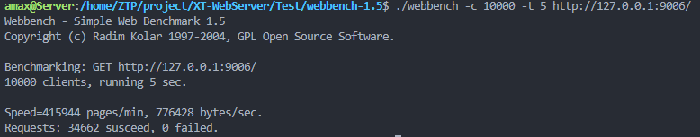

# 小天的小型C++服务器\^\-\^

## 1.介绍
这是使用C++实现的轻量级服务器，经压力测试可实现上万并发访问。
- 统一信号源并使用了非阻塞Socket+Epoll模式的IO复用
- 并发和事件处理模型采用半同步/半反应堆模式，同时也支持主线程完成数据读写
- 实现了基于链表的定时器，以删除非活动连接
- 使用状态机解析HTTP请求报文，可访问数据库实现Web用户注册登录和请求服务器文件等功能
- 实现了日志系统，可以记录服务器运行信息

## 2.环境
### 服务器环境
- Ubuntu 16.04.1 server
- gcc 5.4.0 x86_64-linux-gnu
- MySQL 5.7.33
### 浏览器环境
- Chrome
## 3.构建和运行
### 初始化数据库
1.请确认已经安装好数据库，修改下列地址、用户和密码并运行命令。
```shell
mysql -h localhost -u root -pMyHqSql.543 < ./script/mysql_init.sql 
```
2.修改main.cpp中的数据库配置信息。
```c++
    // 登录名
    string user = "root";
    // 密码
    string passwd = "MyHqSql.543";
    // 库名
    string databasename = "webserver";
```
### 从源码构建
```shell
make clean && make server
```
### 启动服务器
```shell
./server
```
### 访问
默认端口9006，请打开浏览器访问。
## 4.测试
### 测试工具
使用[Web Bench](http://home.tiscali.cz/~cz210552/webbench.html)进行测试。
### 构建
```shell
cd Test/webbench-1.5/
make clean && make
```
### 测试命令
```shell
# -c 指定客户端数量 -t 指定测试时间 
./webbench -c 10 -t 2 http://127.0.0.1:9006/
```
### 测试结果
经Webbench压力测试，该服务器可以实现上万的并发连接，所有访问均成功。

## 5.参考
1. 《Linux 高性能服务器编程》by游双和《UNIX网络编程》
2. [TinyWebServer项目](https://github.com/qinguoyi/TinyWebServer),Linux下C++轻量级Web服务器，助力初学者快速实践网络编程，搭建属于自己的服务器。